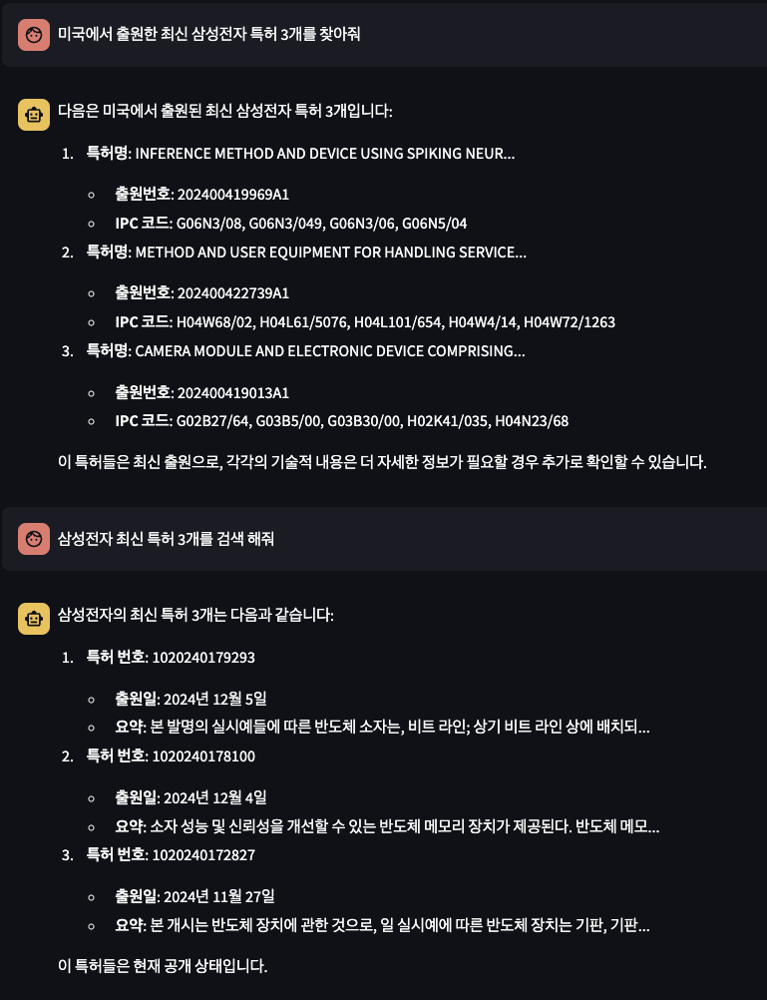

# patent_search_streamlit

## useage packages

* streamlit
* langchain
* langgraph

## TODO

### KIPRIS API 연동

#### 항목별 검색 API 연동

* [X] 키워드 검색 API 연동 [kipris link](https://plus.kipris.or.kr/portal/data/service/DBII_000000000000001/view.do?menuNo=200100&kppBCode=&kppMCode=&kppSCode=&subTab=SC001&entYn=N&clasKeyword=#soap_ADI_0000000000010162)
* [X] 출원인 검색 API 연동 [kipris link](https://plus.kipris.or.kr/portal/data/service/DBII_000000000000001/view.do?menuNo=200100&kppBCode=&kppMCode=&kppSCode=&subTab=SC001&entYn=N&clasKeyword=#soap_ADI_0000000000015118)
* [ ] 특허 등록권자 API 연동 [kipris link](https://plus.kipris.or.kr/portal/data/service/DBII_000000000000001/view.do?menuNo=200100&kppBCode=&kppMCode=&kppSCode=&subTab=SC001&entYn=N&clasKeyword=#soap_ADI_0000000000015121)

#### 도면/전문 검색 API 연동

* [ ] 전문 파일 정보 검색 API 연동 [kipris link](https://plus.kipris.or.kr/portal/data/service/DBII_000000000000001/view.do?menuNo=200100&kppBCode=&kppMCode=&kppSCode=&subTab=SC001&entYn=N&clasKeyword=#soap_ADI_0000000000015134)

### 검색 기능

* [ ] 키워드 검색
  * [X] 특허 상태별 검색(등록, 출원,...) 조건부 검색
  * [X] 특허 조회 수량 연동(10개, 20개, 100개)
  * [ ] 특허 검색시 조건 연동(정렬방식, 정렬기준 연동)
* [X] 출원인 검색
  * [X] 출원인 조회 조건 연동(기업명, 출원인명)
  * [X] 출원인 조회 수량 연동(10개, 20개, 100개)
  * [X] 출원인 검색시 조건 연동(정렬방식, 정렬기준 연동)
* [X] 특허 등록권자 검색
  * [X] 특허 등록권자 조회 조건 연동(기업명, 등록권자명)
  * [ ] 특허 등록권자 조회 수량 연동(10개, 20개, 100개)
  * [ ] 특허 등록권자 검색시 조건 연동(정렬방식, 정렬기준 연동)

### 국내 특허 및 해외 특허 검색 

### 질의 예시

* 키워드 검색
  * '키워드'가 포함된 특허를 찾아줘
  * '키워드'가 포함된 등록 특허를 찾아줘
  * '키워드'가 포함된 특허 및 실용신안을 찾아줘
* 출원인 검색
  * 출원인이 '기업명|출원인명'인 특허를 찾아줘
  * 출원인이 '기업명|출원인명'인 등록 특허를  찾아줘
* 통계 처리
  * 출원인이 '기업명|출원인명'인 최근 특허 10개에서 출원 년도별 카운팅을 해서 표시해줘

## 외부 API 연동

* OpenAI
* LangSmith
* LangGraph

## multi agent 구성

* 국내 특허 검색 에이전트
* 차트화 에이전트(plotly)

## 작업 내용
- 2024/12/29: 국내 특허 및 해외 특허 검색 기능 보정(langgraph 적용)
- 2024/12/27: 국내 특허 및 해외 특허 검색 기능 추가
- 2024/11/03: langgraph 적용중
- 2024/11/02: react_agent 기반 kipris api 연동
- 2024/11/01 : 기본 ui 작성 및 kipris api 기본 구조 작성.
